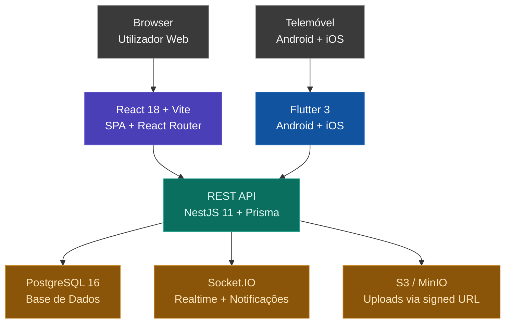

# Economia com História — Angola

> Plataforma educativa sobre história económica de Angola, disponível em Web e Mobile.

[](./LICENSE)
[](./web)
[](./mobile)
[](./backend)

---

## Sobre o Projecto

**Economia com História — Angola** é uma aplicação educativa que integra conteúdos históricos e económicos de forma interactiva e acessível. A plataforma permite aos utilizadores explorar conteúdos multimédia, participar em quizzes, debater no fórum e acompanhar o seu progresso de aprendizagem.

---

## Módulos

| Módulo | Descrição |
|---|---|
| Explorar Conteúdos | Vídeos, textos e podcasts sobre economia e história angolana |
| Quiz Interactivo | Perguntas contextualizadas com pontuação e ranking |
| Fórum de Discussão | Debates e troca de experiências entre utilizadores |
| Comentários | Espaço aberto para reflexões sobre os conteúdos |
| Perfil e Subscrição | Área do utilizador com histórico e notificações |

---

## Arquitectura



---

## Estrutura do Repositório

```text
economia-historia-angola/
├── web/          → Frontend Web (React 18 + Vite + React Router + TailwindCSS)
├── mobile/       → App Mobile (Flutter 3 — Android e iOS)
├── backend/      → API REST (NestJS 11 + Prisma + PostgreSQL + Socket.IO)
└── docs/         → Artefactos académicos (requisitos, diagramas, protótipos)
```

---

## Stack de Desenvolvimento

| Camada | Tecnologia |
|---|---|
| Web | React 18, Vite 5, React Router 6, TypeScript, TailwindCSS 3 (estado via React Context; cliente `fetch` próprio) |
| Mobile | Flutter 3, Dart, Material 3, Riverpod, Go Router |
| Backend | NestJS 11, Prisma 7 ORM, TypeScript, Socket.IO |
| Base de dados | PostgreSQL 16 (extensão `citext`) |
| Auth | JWT (access + refresh) + Argon2 (no próprio backend) |
| Storage | S3 / Cloudflare R2 / MinIO (upload por signed URL) |
| Deploy Web | Estáticos (build Vite → `dist/`) |
| Deploy Backend | Docker (multi-stage) |

---

Consulta os READMEs individuais de cada pasta para instruções detalhadas:

- [`docs/README.md`](./docs/README.md)
- [`web/README.md`](./web/README.md)
- [`mobile/README.md`](./mobile/README.md)
- [`backend/README.md`](./backend/README.md)